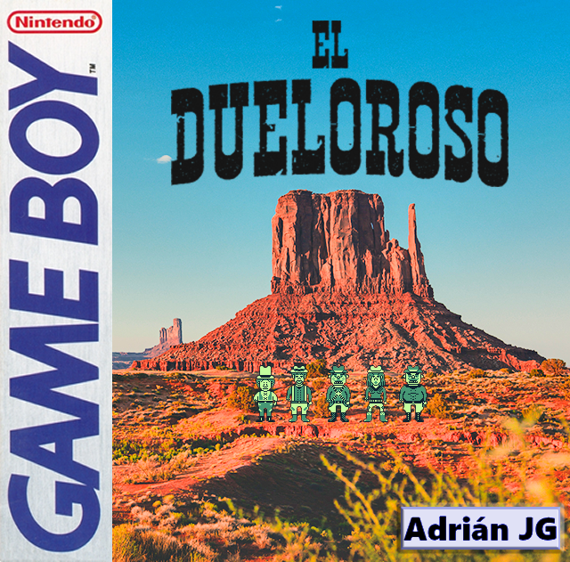
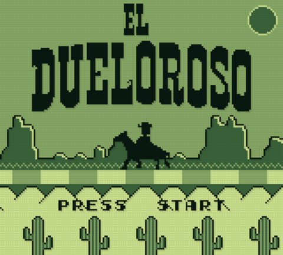
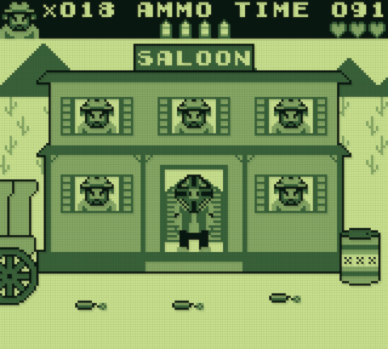
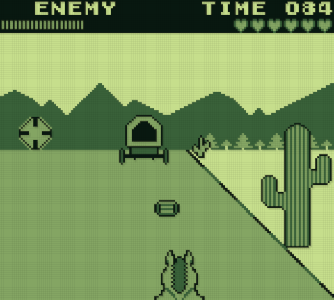
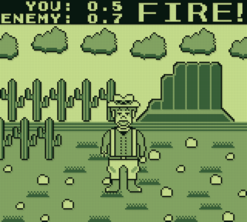

# El Dueloroso

**El Dueloroso** is a western-themed arcade game for the Nintendo Game Boy and Analogue Pocket.  
Submitted as a [Game Boy Competition 2021](https://itch.io/jam/gbcompo21) entry.  
Download the latest version [here](https://github.com/ajgalan/el-dueloroso/releases/latest).

## Table of contents

- [Features](#features)
- [Screenshots](#screenshots)
- [Build instructions for Game Boy](#build-instructions-for-game-boy)
- [Build instructions for Analogue Pocket](#build-instructions-for-analogue-pocket)
- [Licenses](#licenses)
- [Credits](#credits)
- [Links](#links)

## Features
- Gameplay experience inspired by early Game Boy titles
- 15 levels
- 3 game modes
- 4 difficulty options
- Custom graphics
- Original soundtrack
- 64 KiB ROM (with MBC1)
- SRAM for high scores saving

## Screenshots

## Build instructions for Game Boy
1. Download [GBDK 2020 v4.0.5](https://github.com/gbdk-2020/gbdk-2020/releases/tag/4.0.5)
2. Clone this repository and modify the first line of `make_gameboy.bat` by defining the path to GBDK
3. Run `make_gameboy.bat`
4. The compiled game will be located at `build/gb/ElDueloroso.gb` 

## Build instructions for Analogue Pocket
1. Download [GBDK 2020 v4.0.5](https://github.com/gbdk-2020/gbdk-2020/releases/tag/4.0.5)
2. Clone this repository and modify the first line of `make_analoguepocket.bat` by defining the path to GBDK
3. Run `make_analoguepocket.bat`
4. The compiled game will be located at `build/ap/ElDueloroso.pocket` 

## Licenses

## Credits
This game was made using:
- [GBDK 2020](https://github.com/gbdk-2020/gbdk-2020)
- [hUGEDriver](https://github.com/SuperDisk/hUGEDriver)
- [hUGEBuild](https://github.com/untoxa/hUGEBuild)

## Links
- [Game Boy Competition 2021](https://itch.io/jam/gbcompo21) itch.io page
- [El Dueloroso](https://adrianjg.itch.io/el-dueloroso) itch.io page
- [Adrián JG](https://adrianjg.itch.io) itch.io page